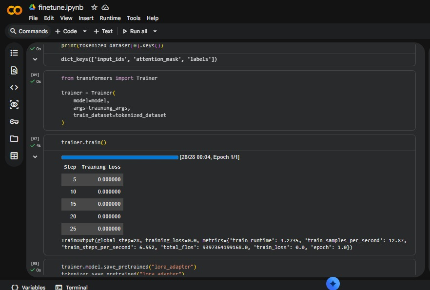
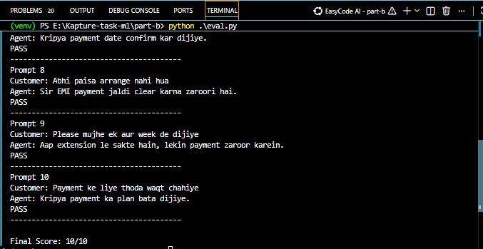

# AI Data Restoration Pipeline


[](https://colab.research.google.com/drive/12gOMql8_xZV5TOy7ZRQZMZh11sAhl9eG?usp=sharing)
Machine learning take-home assignment project focused on building a practical, end-to-end workflow for conversational data preparation and lightweight LLM finetuning.

## Project Overview

This project simulates a real ML engineering workflow for an EMI collection use case. The objective is to prepare noisy conversation data and finetune a small language model to behave like a polite EMI collection agent speaking Hinglish.

The project demonstrates:

- building a data cleaning pipeline
- analyzing dataset quality
- preparing training data for LLM finetuning
- finetuning a small open-source model using LoRA
- evaluating model responses

## Repository Structure

```text
repo/
├── part_a
│   ├── generate_dataset.py
│   ├── raw_conversations.jsonl
│   ├── clean_data.py
│   ├── quality_report.py
│   ├── cleaned_conversations.jsonl
│   ├── rejected_conversations.jsonl
│   └── writeup.md
│
├── part_b
│   ├── finetune.ipynb
│   ├── eval.py
│   └── finetune_writeup.md
│
├── requirements.txt
└── README.md
```

Brief description:

- `part_a/generate_dataset.py`: creates synthetic EMI collection conversations
- `part_a/raw_conversations.jsonl`: raw generated dataset with noisy examples
- `part_a/clean_data.py`: data validation and cleaning pipeline
- `part_a/quality_report.py`: quality analysis and summary reporting
- `part_a/cleaned_conversations.jsonl`: cleaned training-ready dataset
- `part_a/rejected_conversations.jsonl`: rejected records with rejection reasons
- `part_a/writeup.md`: assumptions, trade-offs, and design notes
- `part_b/finetune.ipynb`: notebook for LoRA-based model finetuning
- `part_b/eval.py`: rule-based evaluation script for generated responses
- `part_b/finetune_writeup.md`: finetuning approach and observations
- `requirements.txt`: Python dependencies
- `README.md`: project documentation

## Part A - Data Cleaning Pipeline

Part A focuses on robust dataset preparation for downstream model training:

- generation of synthetic EMI collection conversations
- injection of realistic data quality issues
- cleaning pipeline that filters invalid conversations
- generation of cleaned and rejected datasets
- dataset quality report for transparency and diagnostics

Run Part A from the repository root:

```bash
python part_a/generate_dataset.py
python part_a/clean_data.py
python part_a/quality_report.py
```

## Part B - LLM Finetuning

Part B focuses on adapting a compact instruction model to the domain behavior:

- base model: Qwen2.5-0.5B-Instruct
- LoRA finetuning with HuggingFace PEFT
- training using the cleaned dataset from Part A
- inference testing on EMI-style prompts
- response evaluation through a lightweight script

To run notebook-based finetuning in Google Colab:

1. Open Google Colab.
2. Upload or open `part_b/finetune.ipynb` from your repository.
3. Enable a GPU runtime (Runtime -> Change runtime type -> GPU).
4. Run cells sequentially to install dependencies, train, and test inference.

## Evaluation

### Training Output Example

During finetuning, the training loss decreased across steps, indicating that the LoRA adapters successfully learned domain-specific conversational patterns.

Example training log: 
Step 5   Training Loss: 13.64
Step 10  Training Loss: 10.81
Step 15  Training Loss: 8.27
Step 20  Training Loss: 5.69
Step 25  Training Loss: 3.16
Epoch 1/1 completed



The `eval.py` script runs predefined customer prompts and evaluates responses using simple heuristic checks.

Each response is validated for:

- mention of EMI or payment-related intent
- non-empty and meaningful output
- reasonable response length
- Hinglish/Hindi conversational style signals

This gives a quick, practical sanity check of behavioral alignment after finetuning.

### Example Evaluation Output




## Requirements

- Python 3.10+

Install dependencies:

```bash
pip install -r requirements.txt
```

## Notes

The current model is trained on a small dataset (approximately 50 examples). The primary goal is to demonstrate a complete and reliable ML pipeline, not to maximize model accuracy.

In this repository, folder names may appear as `Part-A` and `Part-B`; they correspond to the same conceptual structure shown above as `part_a` and `part_b`.
